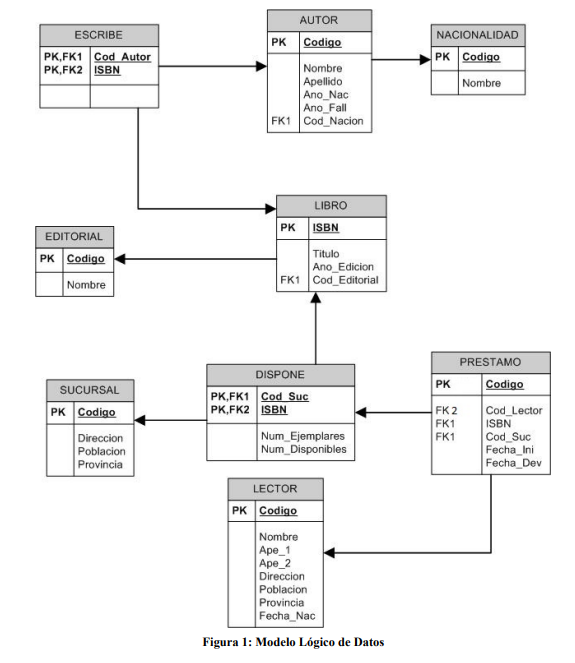

# SQL Exercises

Ejercicios resueltos de SQL (Oracle) organizados por sesiones, con el esquema de la base de datos utilizada.

## Base de datos

Motor: **Oracle Database**.

Sistema de gestión de una biblioteca (editoriales, libros, autores, sucursales, lectores y préstamos).



## Estructura

```
sql-exercises/
├── schema/
│   ├── CreaBD.sql       # Creación de tablas
│   ├── CargaBD.sql      # Carga de datos
│   └── diagram.png      # Modelo lógico de datos
└── exercises/
    ├── sesion2/          # SQL*Plus: spool, save, ejecución de scripts
    ├── sesion3/          # Índices, vistas, sinónimos, privilegios
    ├── sesion4/          # Disparadores (triggers)
    ├── sesion5/          # PL/SQL
    ├── sesion7/          # Consultas al catálogo del sistema
    └── sesion8/          # Pro*C (embedded SQL)
```

## Uso

Desde SQL*Plus, conectado a la base de datos, para crear el esquema y cargar los datos:

```sql
@schema/CreaBD.sql
@schema/CargaBD.sql
```

Cada ejercicio resuelto de `exercises/sesionX/` se puede ejecutar igual, indicando su ruta:

```sql
@exercises/sesion2/SOL2.sql
```

Los archivos `.pc` de `exercises/sesion8/` corresponden a Pro*C (SQL embebido en C) y requieren precompilación con el precompilador `proc` de Oracle antes de compilarse como código C.

## Contexto

Ejercicios resueltos para prácticas de Sistemas de Bases de Datos — Universidad de Salamanca. Uso educativo/personal.
